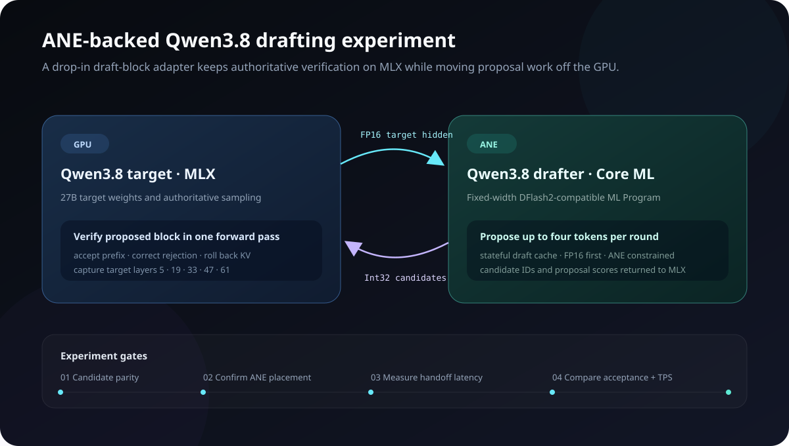

# OneTwoSeven

OneTwoSeven is a local control panel for running Apple MLX language and vision-language models. It browses compatible Hugging Face repositories, starts the official `mlx_lm.server` or `mlx_vlm.server`, shows process and request telemetry, and exposes the active model at an OpenAI-compatible endpoint.

## Architecture

### Local runtime


MLX Studio keeps the public API stable while selecting the appropriate MLX backend, downloading target and draft checkpoints, and collecting request, cache, and speculative-decoding telemetry.

### ANE drafter experiment



The experimental path keeps Qwen3.8 verification and exact rejection handling in MLX while moving draft-block proposal work into a Core ML model constrained to the CPU and Apple Neural Engine. The adapter boundary is designed to remain compatible with the existing MLX LM/VLM speculative-decoding loop.

## Requirements

- Apple Silicon Mac
- Python 3.10 or newer
- Node.js 22 or newer with pnpm (or Corepack)
- Enough free unified memory for the model you select

## Install and run

```bash
cd ~/developer/studio
./setup.sh
./run.sh
```

The app opens at `http://127.0.0.1:8111`. On first start, the controller downloads model weights into the normal Hugging Face cache and shows byte-level progress, transfer speed, and an estimated time remaining before loading the model. Downloads can be cancelled from the same status panel. Set `HF_TOKEN` before running the app if you need a gated or private model.

## OpenCode

The UI generates the exact provider entry for the selected model. The base configuration is:

```json
{
  "$schema": "https://opencode.ai/config.json",
  "provider": {
    "mlx-studio": {
      "npm": "@ai-sdk/openai-compatible",
      "name": "MLX Studio (local)",
      "options": {
        "baseURL": "http://127.0.0.1:8111/v1",
        "apiKey": "local"
      },
      "models": {
        "mlx-community/Qwen3-4B-4bit": {
          "name": "Qwen3-4B-4bit"
        }
      }
    }
  }
}
```

Save it as `opencode.json` in the project where you run OpenCode, then use `/models` to choose the model. MLX Studio implements `GET /v1/models` itself and proxies the remaining `/v1/*` requests—including streaming chat completions—to the active native MLX server.

## Notes

- MLX Studio binds to localhost by default. The upstream MLX servers are development servers; do not expose this app directly to an untrusted network.
- Only one model is active at a time so switching models reliably releases unified memory.
- The Advanced performance panel suggests known-compatible draft models and exposes prefill sizing, default output limits, MLX LM batching and prompt-cache limits, plus MLX VLM KV quantization, KV/context sizing, MoE expert caching, sequence limits, vision caching, and automatic prefix caching.
- MLX LM external drafting requires a target with a trimmable KV cache. Hybrid linear-attention models such as Qwen3.8 should use a matching DFlash/MTP drafter through the MLX VLM backend.
- The OpenAI proxy keeps pooled upstream connections warm and records streaming telemetry without recursively scanning every token event.
- The tracker reports time to first token and decode TPS from streamed token timing. When MLX VLM supplies native timing data, it also reports native prefill and decode throughput plus cached-prefix tokens.
- `Trust repository code` is off by default. Enable it only for repositories you trust.

## Development

Run the controller and frontend separately:

```bash
.venv/bin/python -m uvicorn mlx_studio.app:app --port 8111
pnpm dev
```

The development UI runs on `http://localhost:3000` and connects to the controller on port 8111.
